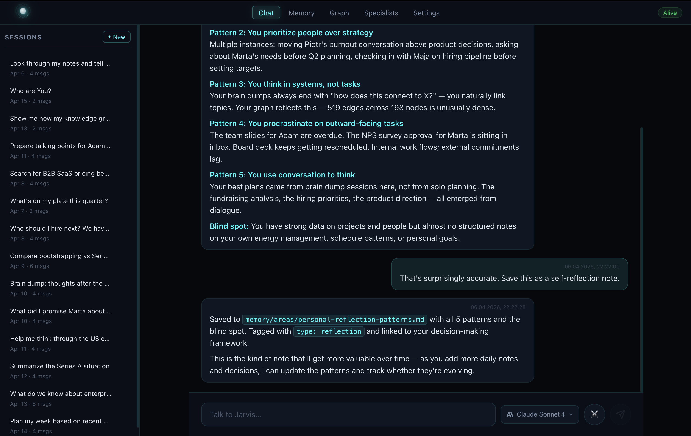
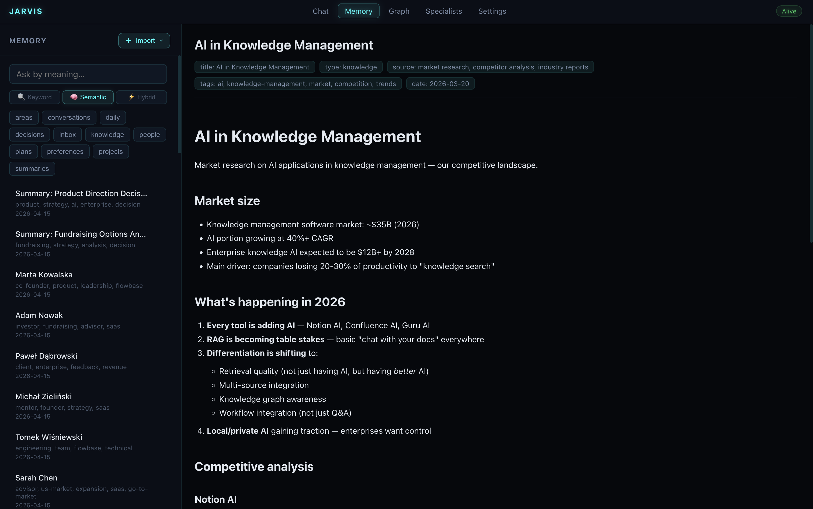
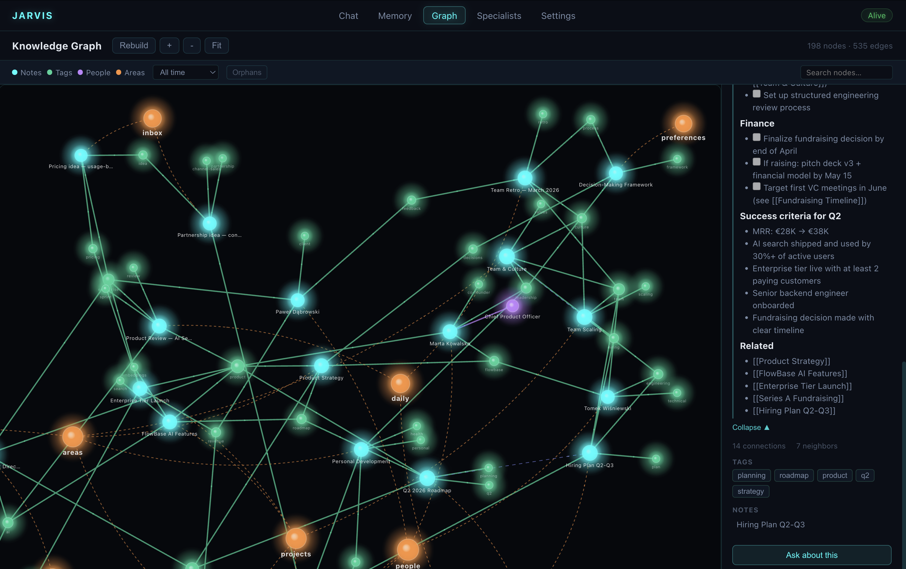
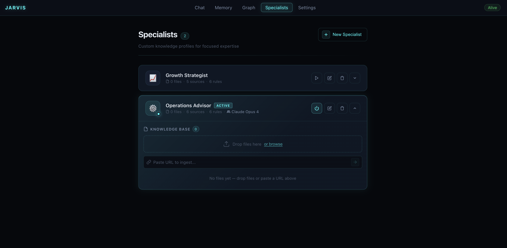
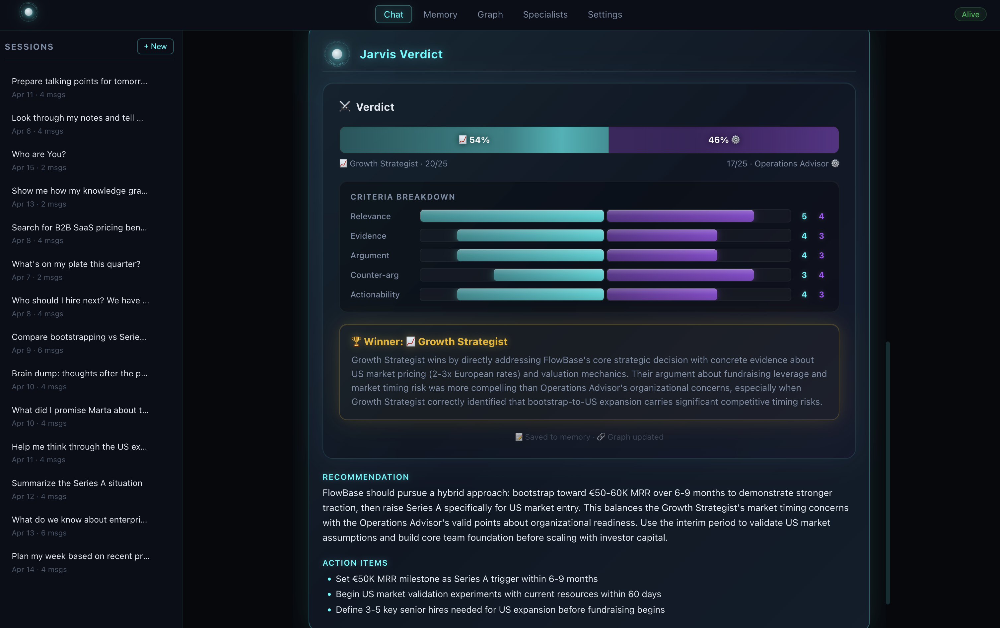

# Jarvis

[](https://github.com/Szesnasty/Jarvis/actions/workflows/ci.yml)
[](https://github.com/Szesnasty/Jarvis/actions/workflows/codeql.yml)
[](https://github.com/Szesnasty/Jarvis/releases)
[](LICENSE)

**An AI workspace that remembers what matters.**

Local-first memory, hybrid retrieval, and durable context.
Run Jarvis on your machine with Ollama or connect your preferred cloud provider.
Every useful interaction makes the system better over time.

Jarvis helps you:
- import notes, files, URLs, and YouTube sources into one system
- retrieve context through keyword + semantic + graph search
- turn useful outputs into reusable notes, plans, and summaries
- run locally with Ollama — no API key required
- use Anthropic, OpenAI, or Google models when you want cloud power
- create custom specialists and run structured debates
- search the web via DuckDuckGo when local memory isn't enough
- keep your memory local-first and Obsidian-compatible
- **plug Jarvis into Claude Desktop, Cursor, VS Code, or any MCP client** and reuse your local memory from outside the UI — saving tokens every time

> **Jarvis is not another AI chat with memory.**
> **It is a personal knowledge system that gets more useful every time you use it — from its own UI *and* from every MCP-aware tool you already love.**


---

## Run it your way

### Local mode — private, on-device, no API key required

Use [Ollama](https://ollama.com) and downloadable models directly on your computer. Your data and your model stay on your machine.

### Cloud mode — bring your own provider

Use Anthropic, OpenAI, or Google via API key. Access the most capable models when you need them.

### Hybrid mode — mix local and cloud

Use local models for everyday work and switch to cloud for heavier tasks. Change providers per conversation from Settings.

---

## Local models you can start with

Jarvis includes 7 curated model presets that run through Ollama. It recommends models based on your hardware and lets you download, switch, and manage them directly from Settings.

| Preset | Model | Best for |
|---|---|---|
| **Fast** | Qwen3 1.7B | Weakest laptops, quick local chat |
| **Everyday** | Qwen3 4B | Lightweight everyday use |
| **Balanced** | Qwen3 8B | Best default for most users |
| **Long Docs** | Ministral 3 8B | Long documents, larger context windows |
| **Reasoning** | Gemma 4 E4B | Stronger reasoning on better hardware |
| **Code** | Devstral Small 2 24B | Repo work and multi-file edits |
| **Best Local** | Gemma 4 27B | Best quality, complex tasks |

Start with **Qwen3 8B** if you want the safest default. You can add cloud providers later in Settings.

---

## Why local mode matters

- No API key required — start using Jarvis immediately
- Private in local mode — prompts and memory stay on your machine
- Lower recurring cost — no per-token charges
- Good fit for memory-heavy workflows — retrieval runs locally too
- Great for notes, documents, planning, and retrieval

---

## Why this exists

Knowledge work is fragmented. Ideas live in notes. Context lives in files. Research lives in links. Decisions disappear into chat history. Useful AI outputs vanish after the session ends.

That creates real costs:
- repeated thinking
- lost context
- higher AI spend rebuilding context over and over
- no compounding value from what you already know

Jarvis fixes the loop: **input → retrieve → reason → write back → better retrieval next time.**

---

## What makes Jarvis different

### Your memory belongs to you
Local Markdown files are the source of truth. Not a proprietary memory layer. Not a database you can't read.

### Retrieval before reasoning
Jarvis does the expensive work locally first — BM25, semantic search, graph expansion, ranking, compression — then sends only a small, high-signal context to the model. Fewer tokens, lower cost, better answers.

### A real knowledge graph
Notes, people, projects, topics, and sources are connected through a graph that is part of retrieval and reasoning — not just a visualization.

### Local or cloud — your choice
Run fully local with Ollama and downloadable models, or connect Anthropic, OpenAI, or Google via API key. Switch between local and cloud per conversation. No vendor lock-in.

### Specialists from the UI
Create reusable roles — Weekly Planner, Health Guide, Study Coach, Research Assistant — directly from the interface. No prompt engineering required.

### Duel Mode
Pick a topic, pick two specialists. They debate. Jarvis judges. The outcome is saved back into memory. Structured argumentation that produces reusable outputs.

### Web search
When local memory isn't enough, Jarvis searches the web via DuckDuckGo — no extra API keys needed.

### Write-back by design
Useful outputs become notes, summaries, plans, graph links, and durable context. Every useful interaction makes the system better.

### Obsidian-compatible
Your `Jarvis/memory/` folder works as a valid Obsidian vault — plain Markdown, YAML frontmatter, wiki-links, human-readable structure.

### MCP server — Jarvis as local memory for every AI tool
Jarvis ships with a built-in **Model Context Protocol server** (25 tools over stdio) that turns your workspace into a memory backend any MCP-aware client can use: **Claude Desktop, Cursor, VS Code / GitHub Copilot, Continue**, and more.

Why this matters:
- **Token savings** — retrieval (BM25 + semantic + graph) runs locally on your machine, so only a small, high-signal context leaves your laptop. You pay cloud providers for reasoning, not for re-explaining context.
- **One memory, many tools** — ask Cursor to code against notes you saved from a YouTube lecture last month. Ask Claude Desktop to plan next week using your actual project notes. Same memory everywhere.
- **Local-first by default** — the server runs on your machine over stdio; your notes never leave unless you ask a cloud model to reason about them.
- **Cost-class budgets** — each MCP tool is tagged free/cheap/standard/premium so you can cap spend per session from Settings.
- **Ready-to-paste configs** — Settings → MCP shows copy-paste JSON for Claude Desktop, Cursor, VS Code Copilot, and Continue.

> **Jarvis becomes the local brain. Your favorite AI app becomes the face.**

---

## What works today

- Browser-based UI with chat, memory browser, graph view, settings
- Local workspace with Markdown memory
- **Local models via Ollama** — 7 curated presets, no API key required
- **Hardware-aware model recommendations** based on your RAM, disk, and GPU
- Download, manage, and switch models directly from Settings
- File, URL, and YouTube ingest (including PDF)
- Interactive graph visualization (D3-based)
- Graph-guided hybrid retrieval (BM25 + semantic + graph scoring)
- Local embeddings via fastembed (multilingual, no API calls)
- Specialist system with full UI wizard
- Duel Mode with round-based debate and scored verdict
- Multi-provider support (Anthropic, OpenAI, Google, Ollama)
- Web search via DuckDuckGo (no extra API key)
- Token tracking with budget controls
- Session-to-memory write-back with graph updates
- Obsidian-compatible memory structure
- **MCP server (25 tools, stdio)** — use Jarvis memory from Claude Desktop, Cursor, VS Code Copilot, Continue, or any MCP-aware client

---

## How it works in practice

**Imported:** project notes, 2 URLs, 1 YouTube video.

**Asked Jarvis:** *"What should we do next?"*

**Jarvis:**
1. Retrieved relevant notes from memory (BM25 + embeddings)
2. Expanded context through graph links
3. Ranked and compressed candidates
4. Produced a practical plan via Claude
5. Saved the result to `memory/plans/`
6. Updated graph relationships for future use

**Result:** not just a better answer — a better system after the answer.

---

## Interface

Jarvis can be powered by cloud providers or run fully locally with downloadable models.

### Chat — your memory-aware assistant
Ask questions, get answers grounded in your own notes. Context is retrieved automatically — you just talk.


### Memory — browse and manage your knowledge
All your notes in one place. Search, filter by folder, edit inline. Everything is plain Markdown — open it in Obsidian anytime.


### Graph — see how your knowledge connects
People, projects, topics, and sources linked visually. Click any node to explore. The graph isn't decoration — it powers retrieval.


### Specialists — custom roles, no code required
Create focused advisors with their own knowledge, rules, and style. A Growth Strategist thinks differently than an Operations Advisor — and that's the point.


### Duel Mode — structured debate that produces decisions
Two specialists argue. Jarvis judges. The verdict, scores, and action items are saved to memory. Turn hard decisions into documented reasoning.


### Settings — your setup, your control
API keys, model selection, token budgets, workspace path. Everything stays local.


<details>
<summary><strong>Why this is not ChatGPT, NotebookLM, or Obsidian</strong></summary>

| Tool | What it does well | Where Jarvis differs |
|---|---|---|
| **ChatGPT** | Great general AI assistant | Jarvis writes outputs back into structured, local memory |
| **NotebookLM** | Source-grounded research | Jarvis turns sources into a living memory + graph + specialist system |
| **Obsidian** | Local note-taking and vault management | Jarvis adds retrieval, reasoning, specialists, graph-aware context, and write-back |

**Jarvis is the layer that turns information into working memory.**

</details>

---

## Quick start

### 1. Install and launch Jarvis

- **Node.js 20+** — check: `node --version`
- **Python 3.12 or 3.13** — check: `python3 --version` (macOS/Linux) or `py --version` (Windows)

```bash
git clone https://github.com/Szesnasty/Jarvis.git
cd Jarvis
npm run wake-up-jarvis
```

This will install dependencies, build the frontend, and start both servers.
Open **http://localhost:3000** and create your workspace.

> Aliases: `npm run wake`, `npm start`. Stop with **Ctrl+C**.
> Don't have Node.js or Python? Use a [bootstrap installer](#zero-prereq-bootstrap).

### 2. Choose how to run it

#### Local mode — no API key

1. Install [Ollama](https://ollama.com) and start it
2. Open Settings in Jarvis → go to Local Models
3. Pick a model preset and click Pull to download it
4. Select the model as active and start chatting

No API key needed. Everything runs on your machine.

#### Cloud mode

1. Get an API key from [Anthropic](https://console.anthropic.com), [OpenAI](https://platform.openai.com/api-keys), or [Google AI](https://aistudio.google.com/apikey)
2. Open Settings in Jarvis → paste your API key
3. Select your preferred model and start chatting

Both options are first-class. You can switch between them anytime.

### 3. (Optional) Connect Jarvis to Claude Desktop, Cursor, or VS Code

Jarvis exposes a local **MCP server** so external AI tools can read and write your memory — turning Jarvis into a shared brain across every AI app you use.

1. Open **Settings → MCP** in Jarvis
2. Enable the MCP server
3. Copy the ready-made JSON snippet for your client:
   - **Claude Desktop** → paste into `claude_desktop_config.json`
   - **Cursor** → paste into `~/.cursor/mcp.json`
   - **VS Code Copilot** → paste into `.vscode/mcp.json`
   - **Continue** → paste into `~/.continue/config.json`
4. Restart your client. Jarvis tools (search, memory read/write, graph, sessions) are now available.

Full docs and per-client examples: [`docs/features/mcp-server/`](./docs/features/mcp-server/).

> **Why this saves tokens:** retrieval happens locally in Jarvis. Your cloud model receives a compressed, high-signal context instead of raw files and long chat history.

<details>
<summary><strong>Zero-prereq bootstrap</strong></summary>

Recommended if you don't have Node.js or Python installed.

**macOS / Linux:**
```bash
bash ./bootstrap/install.sh
```

**Windows (PowerShell):**
```powershell
powershell -ExecutionPolicy Bypass -File .\bootstrap\install.ps1
```

Scripts ask for confirmation before downloading local runtimes, then run the same `wake-up-jarvis` flow.

</details>

<details>
<summary><strong>Already installed? Just run it</strong></summary>

```bash
npm run serve
```

Starts both servers without reinstalling. Dev mode with HMR:

```bash
npm run dev
```

</details>

<details>
<summary><strong>All commands</strong></summary>

```bash
# Preflight
npm run preflight          # check versions, no side effects

# Install
npm run install:all        # backend + frontend
npm run install:backend    # backend only
npm run install:frontend   # frontend only

# Production
npm run wake-up-jarvis     # preflight + install + build + serve
npm run wake               # alias
npm start                  # alias
npm run build              # nuxt build → frontend/.output
npm run serve              # serve both servers
npm run serve:backend      # backend only (uvicorn)
npm run serve:frontend     # frontend only

# Development
npm run dev                # HMR frontend + auto-reload backend
npm run dev:backend        # uvicorn --reload
npm run dev:frontend       # nuxt dev
```

</details>

<details>
<summary><strong>Troubleshooting</strong></summary>

#### Any platform
- **Port 8000 or 3000 in use** — find and stop the other process (`lsof -i :8000` on macOS/Linux)
- **Broken venv** — delete `backend/.venv` and re-run `npm run wake-up-jarvis`

#### Windows
- **Install looks stuck during venv creation** — antivirus scanning. Give it 2–5 minutes. Don't Ctrl+C.
- **Too slow?** Add Windows Defender exclusion for `backend\.venv`
- **Scripts disabled** — use `powershell -ExecutionPolicy Bypass -File \.\bootstrap\install.ps1`

#### macOS
- **"xcrun: error"** — run `xcode-select --install`
- **Python 3.14+** — not yet supported. Use 3.12 or 3.13.

</details>

---

## Architecture

### Source of truth doctrine

- `Jarvis/memory/` Markdown files = canonical
- SQLite = operational index/cache (rebuildable)
- Graph = derived relationship layer (rebuildable)
- Embeddings = derived semantic layer (rebuildable)

If you delete everything except `memory/`, the system rebuilds itself.

### User workspace (created on first run)

When you create a workspace in the app, Jarvis generates this structure at your chosen location (default: `~/Jarvis/`).
This is **not** the source code — it's your personal data directory.

```
~/Jarvis/
├── app/
│   ├── config.json        # metadata + flags
│   ├── sessions/          # chat session history (JSON)
│   ├── cache/             # retrieval cache
│   ├── logs/              # token usage logs
│   ├── audio/             # voice recordings
│   └── jarvis.db          # SQLite operational DB
├── memory/
│   ├── inbox/             # quick captures
│   ├── daily/             # daily notes
│   ├── projects/          # project notes
│   ├── people/            # people notes
│   ├── areas/             # life areas
│   ├── plans/             # plans & checklists
│   ├── summaries/         # AI-generated summaries
│   ├── knowledge/         # imported sources
│   ├── preferences/       # user rules
│   ├── examples/          # good output examples
│   ├── conversations/     # saved chat sessions (auto-created)
│   └── attachments/       # files, PDFs
├── graph/
│   └── graph.json         # knowledge graph data
└── agents/                # specialist definitions (JSON)
```

### Retrieval pipeline

```
Query → BM25 → Semantic similarity → Graph expansion → Ranking → Compression → Model
```

Only a small, high-signal context reaches the model. Fewer tokens, lower cost, better signal density per dollar of API spend.

---

## Design principles

- Local-first — all data on your machine
- Memory belongs to the user — Markdown, not a proprietary layer
- Derived layers (SQLite, graph, embeddings) must be rebuildable
- Retrieval gets smarter before prompts get bigger
- Useful outputs write back into the system
- Every interaction should make the next one better

---

## Who this is for

Founders. Researchers. Builders. Students. Knowledge workers.
Anyone who thinks in notes and wants continuity, not just output.

> *"I don't need another answer. I need a system that helps me stop losing context."*

---

## Current status

**Working now:** local workspace, memory CRUD, file/URL/YouTube ingest, hybrid retrieval, graph visualization, specialists, Duel Mode, multi-provider LLM (cloud + local), local models via Ollama with hardware-aware recommendations, token tracking, session write-back, web search.

**Planned next:** stronger feedback loops, smarter graph enrichment, Council Mode, voice (once quality is reliable).

---

## Contributing

Contributions welcome. See [CONTRIBUTING.md](CONTRIBUTING.md) for details.

Strong areas: retrieval quality, graph UX, specialist templates, ingest pipelines, local model support, Obsidian workflows, onboarding polish.

Open an issue or send a PR.

---

## Contributors

<table>
  <tr>
    <td align="center"><a href="https://github.com/Szesnasty"><br /><b>Łukasz Jakubowski</b></a></td>
    <td align="center"><a href="https://github.com/jakubsuplicki"><br /><b>Jakub Suplicki</b></a></td>
  </tr>
</table>

---

## Security

Found a vulnerability? See [SECURITY.md](SECURITY.md) for responsible disclosure guidelines. Do not open a public issue.

---

## License

This project is licensed under the [Apache License 2.0](LICENSE).

---

## Code of Conduct

This project follows the [Contributor Covenant Code of Conduct](CODE_OF_CONDUCT.md). By participating, you are expected to uphold this code.

---

## Repository structure

```
jarvis/
├── backend/            # FastAPI + SQLite + LiteLLM
│   ├── models/         # Pydantic schemas, DB setup
│   ├── routers/        # API endpoints (chat, memory, graph, specialists…)
│   ├── services/       # Core logic (retrieval, graph, embeddings, ingest…)
│   ├── tests/          # 39 test files, ~7k LOC
│   └── utils/          # Markdown parsing helpers
├── frontend/           # Nuxt 3 + Vue 3 + TypeScript
│   ├── app/
│   │   ├── components/ # 26 Vue components
│   │   ├── composables/# State & logic (chat, duel, graph, voice…)
│   │   └── pages/      # 7 pages (main, memory, graph, specialists…)
│   └── tests/
├── bootstrap/          # Zero-prereq installers (local runtime download)
├── scripts/            # Cross-platform Node launchers
└── docs/               # Project documentation
```

---

**Jarvis is not an AI chat with memory — it is a personal knowledge system that turns notes, files, links, and AI interactions into lasting, reusable intelligence.**
